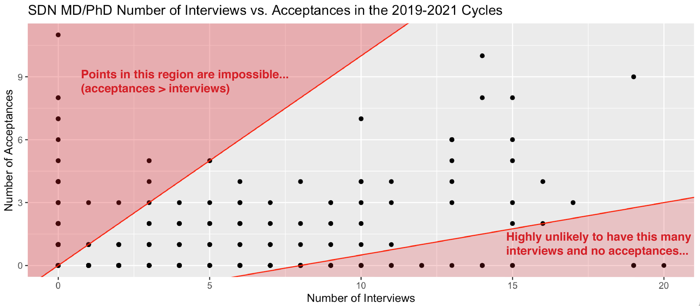

# SDN MD/PhD Data Parser
This is a parser for MD/PhD data from SDN. This project is a variation on work previously done by 
[TooFastDan](https://github.com/toofastdan117), you can see his work/github repository [here](https://github.com/toofastdan117/SDN_Physician_Scientist_Analysis).

The latest version of this data is available on Google Drive [here](https://docs.google.com/spreadsheets/d/1uNUR_4qIuykpqcXvJzfKoAtClFlbIu5FVyyR7nfI5As).

You can view some of my analysis of this data [here](https://runningmsn.github.io/).

## Don't Trust this Data!
While over-analyzing MD/PhD cycle data can be fun for us nerds, it's important to acknowledge that data from SDN is 
biased and extremely limited. Here are a few reasons why SDN data is unreliable:

1. SDN has a bias toward higher-achieving posters. Data may be biased toward earlier interviews/acceptances, and 
greater volumes of interviews/acceptances than the typical student.
2. There is a high variability in reporting between users. Some people may not report all of their results or may only 
report some categories of results (e.g. interviews/rejections, but not acceptances, etc.).
3. Some users may only report a fraction of the results within a single category.

The following graph of interview vs. acceptance count from the 2019-2021 cycles is a good example of why this data 
should not be taken at face value.



## Using This Tool
I will likely stop updating the data for this tool after the 2022 cycle. 
However, updating it for future cycles is extremely easy. For each new cycle, 
add a .txt file with the cycle year into the acceptances, interviews, and rejections folders 
that contains the data for that year. For the tool to work correctly, you will need to make sure 
the data files are formatted correctly. The file formatting guidelines are shown in a following section. 
For the best output data, make sure to use the same school names between cycles. You can refer to my 
existing data files for file formatting examples.

After updating the data, run the parse_data.py file. The data output spreadsheets will be generated in the outputs folder.

## Data File Formatting
Interviews:

```
School 1: User_1 (C: [complete date], II: [interview received date]), User_2 (C: [complete date], II: [interview received date]), ...
School 2: User_1 (C: [complete date], II: [interview received date]), User_2 (C: [complete date], II: [interview received date]), ...
...
```

Acceptances:

```
School 1: User_1 (I: [interview date], A: [acceptance received date]), User_2 (I: [interview date], A: [acceptance received date]), ...
School 2: User_1 (I: [interview date], A: [acceptance received date]), User_2 (I: [interview date], A: [acceptance received date]), ...
...
```

Pre-Interview Rejections:

```
School 1: User_1 (C: [complete date], R: [rejection received date]), User_2 (C: [complete date], R: [rejection received date]), ...
School 2: User_1 (C: [complete date], R: [rejection received date]), User_2 (C: [complete date], R: [rejection received date]), ...
...
```

Post-Interview Rejections:

```
School 1: User_1 (I: [interview date], R: [rejection received date]), User_2 (I: [interview date], R: [rejection received date]), ...
School 2: User_1 (I: [interview date], R: [rejection received date]), User_2 (I: [interview date], R: [rejection received date]), ...
...
```